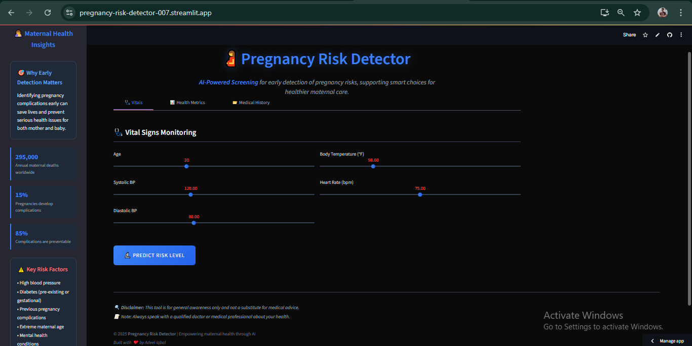

# 🤰 Pregnancy Risk Detector

A Machine Learning based Streamlit App that predicts High or Low Pregnancy Risk using a tuned Random Forest model, designed to support early detection and improve maternal health outcomes.

🔗 Try it live: [pregnancy-risk-detector-007.streamlit.app](https://pregnancy-risk-detector-007.streamlit.app/)

---

## 📊 Features

Simple and intuitive interface with 3 tabs:
  
- **Vitals**: Age, Blood Pressure, Temperature, Heart Rate
- **Health Metrics**: Blood Sugar, BMI, Mental Health
- **Medical History**: Previous Complications, Diabetes

Instant prediction of **High Risk** or **Low Risk** pregnancy.
Visual results with clean UI and educational sidebars.

---

## 🚀 How to Use

1. Visit the [Live App](https://pregnancy-risk-detector-007.streamlit.app/)  
2. Enter your health details using sliders & dropdowns  
3. Click "Predict Risk Level" to see results instantly

---

## 🧠 Model Info

- Pipeline: Imputation → Scaling → SMOTE → Model  
- Algorithms: Logistic Regression, Random Forest, XGBoost  
- Final Model: **Random Forest (Tuned)**  
- Accuracy: **99.14%**  
- Tools Used: `Pipeline`, `GridSearchCV`, `SMOTE` for class balancing

---

## 📁 Project Structure

```
├── app.py                              # Main Streamlit app
├── pregnancy_risk_detector.pkl         # Trained ML pipeline
├── pregrisk_dataset.csv                # Raw dataset
├── requirements.txt                    # Dependencies
├── assets/
│   └── preview.png                     # Image for README.md
└── .gitignore
```

---

## 🛠️ Tech Stack

Python  |  Pandas  |  Seaborn  |  Scikit-learn  |  Imbalanced-learn  |  XGBoost  |  Streamlit  |  Jupyter Notebook

---

## 🧪 Run Locally

```bash
# Clone the repo
git clone https://github.com/adeel-iqbal/pregnancy-risk-detector.git
cd pregnancy-risk-detector

# Activate your virtual environment (if any)
# Example:
# python -m venv venv
# source venv/bin/activate  (or venv\Scripts\activate on Windows)

# Install dependencies
pip install -r requirements.txt

# Run the app
streamlit run app.py
```

---

## 🖼️ App Preview

Here's the screenshots of the app interface:




## 👤 Author

Made with ❤️ by **Adeel Iqbal**  
🔗 GitHub: [@adeel-iqbal](https://github.com/adeel-iqbal)
